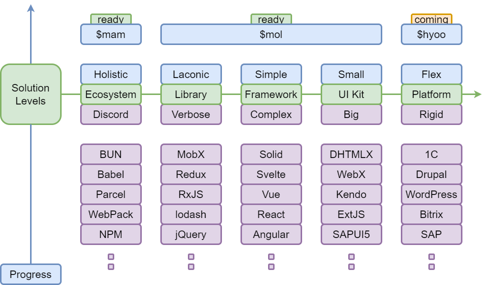

# awesome $mol 
A curated collection of links and resources for the $mol framework

## About $mol

[$mol](https://mol.hyoo.ru) is a reactive, micro-modular UI framework for TypeScript —  
built for maximum speed, simplicity, and flexibility.

- Reactivity everywhere — automatic dependency tracking and updates.
- Micro-modules — each part can be used independently.
- Lazy by default — only computes and renders when needed.
- Cross-platform — works in browsers, Node.js, Electron, etc.

It sits between a simple framework and a small UI kit,  
bridging the gap between low-level libraries and rigid enterprise platforms.

The diagram below shows how $mol relates to other solution levels in the ecosystem:

*Levels of abstraction and ecosystem maturity in the $hyoo stack.*

## Contents
- [Official](#official)
- [Core Libraries](#core-libraries)
- [UI Components](#ui-components)
- [Tooling](#tooling)
- [Starters & Templates](#starters--templates)
- [Examples & Real-world Apps](#examples--real-world-apps)
- [Learning](#learning)
    - [Guides & Tutorials](#guides--tutorials)
    - [Talks & Videos](#talks--videos)
- [Community](#community)
- [Integrations](#integrations)
- [Misc](#misc)
- [Contributing](#contributing)
- [License](#license)

## Official
- **Website** — [mol.hyoo.ru](https://mol.hyoo.ru) — Official homepage with docs and live demos.
- **Docs** — [mol.hyoo.ru/#!section=docs](https://mol.hyoo.ru/#!section=docs) — API reference and concepts.
- **GitHub org** — [hyoo-ru](https://github.com/hyoo-ru) — Main repositories and packages.

## Core Libraries

- **[$mol_atom](https://github.com/hyoo-ru/mam_mol/tree/master/mol/atom)** — Reactive primitives (atoms, dependency tracking, caching, reactivity).
- **[$mol_view](https://github.com/hyoo-ru/mam_mol/tree/master/mol/view)** — Declarative UI layer that renders automatically via reactivity.

## UI Components

- **[$mol_button](https://github.com/hyoo-ru/mam_mol/tree/master/mol/button)** — Reactive button component.
- **[$mol_check](https://github.com/hyoo-ru/mam_mol/tree/master/mol/check)** — Checkbox and toggle components.
- **[$mol_form](https://github.com/hyoo-ru/mam_mol/tree/master/mol/form)** — Reactive form framework.

### Guides & Tutorials
- **“Introduction to $mol — Part 1: Module System (MAM)”** — Deep dive into MAM: conventions over config, verless versioning, build outputs, cross-language modules, dev server workflow. *(Habr, 35 min, RU, 2022)* — covers granular modules, FQN naming, auto imports/exports, bundling for web/node, and repo fractals (mono/poly). [Read on Habr](https://habr.com/ru/articles/662680/)

### $mol / MAM key concepts (TL;DR)
- **Modules-first**: each feature is a module (dir) with multi-language sources.
- **FQN naming**: `$ns_feature_subfeature` makes globals unique & discoverable.
- **Conventions > config**: no per-project config; uniform module layout.
- **Auto deps**: compiler resolves deps by FQN usage; minimal bundles.
- **Verless versioning**: breaking changes → new names; smooth coexistence.
- **Dual targets**: `.web.ts`/`.node.ts` → separate web/node bundles + tests.
- **Dev ergonomics**: live rebuild, deterministic bundle order, cyclic-dep strategy.

